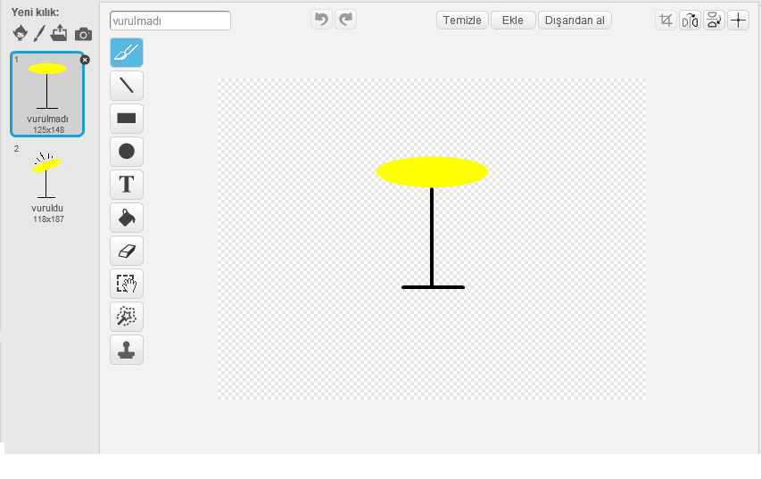

\--- meydan okuma \---

## Meydan okuma: kendi grubunuzu yaratın

Kendi projeni yapmak için bu projede öğrendiklerinizi kullanın! İstediğiniz enstrümanları yaratabilirsiniz - bazı fikirleri almak için mevcut seslere ve enstrümanlara bakın.

Enstrümanların da mantıklı olmak zorunda değil. Örneğin, keklerden yapılmış bir piyano yapabilirsin!

Mevcut spriteları kullanmanın yanı sıra, kendiniz de çizebilirsiniz.

## \--- çöküş \---

## Başlık: Kostüm değiştirirken neden benim sprite'ım atlıyor?

+ Kendi hareketli grafiğinizi oluştururken, hareketli grafiğe tıkladığınızda, kostüm değiştirirken "atlar". Çünkü iki kostüm aynı yerde ortalanmıyor.

Bunu düzeltmek için, **Her iki kostümte kostüm merkezi** ayarlayın ve her iki kostümte de merkezin aynı noktada olduğundan emin olun.

\--- /çöküş \---

Bir mikrofonunuz varsa kendi seslerinizi kaydedebilir, hatta cihazlarınızı vurmak için bir web kamerası kullanabilirsiniz!

\--- /meydan okuma \---