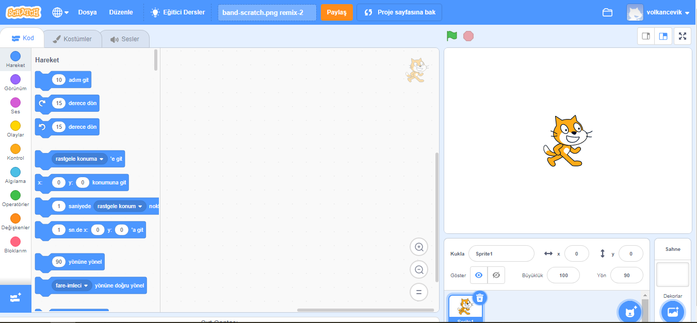
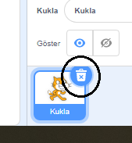
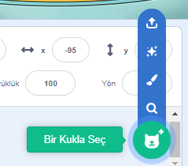

## Spritelar

Kodlamayı başlatabilmeniz için kod yazmak için bir 'şey' eklemeniz gerekir. Scratch'da, bu 'şeylere' **sprite**denir.

\--- task \--- Yeni bir Scratch projesi açın.

**Online:** open a new online Scratch project at [rpf.io/scratch-new](http://rpf.io/scratch-new){:target="_blank"}.

**Çevrimdışı:** Çevrimdışı Düzenleyicide yeni bir proje açın.

If you need to download and install the Scratch offline editor, you can find it at [rpf.io/scratchoff](http://rpf.io/scratchoff){:target="_blank"}.

It looks like this:

 \--- /task \--- \--- task \--- The cat sprite that you can see is the Scratch mascot. You don't need it for this game, so get rid of it by right-clicking it and then clicking on **delete**.

 \--- /task \---

\--- task \--- Next, click on **Choose sprite from library** to open up a list of all the Scratch sprites.

 \--- /task \---

\--- task \--- Scroll down until you see a drum sprite. Click on a drum to add it to your project.

\--- /task \---

\--- task \---

Click and drag the drum to the bottom of the Stage.

\--- /görev \---

\--- task \--- Give your program a name by typing into the text box at the top.

Then click on **File**, and then on **Save now** to save your project.

If you are not online or don't have a Scratch account, you can save a copy of your project by clicking on **Save to your computer** instead.

 \--- /görev \---