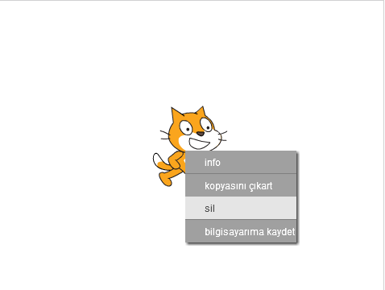

## Sprite

Kodlamayı başlatabilmeniz için kod yazmak için bir 'şey' eklemeniz gerekir. Scratch'da, bu 'şeylere' **sprite**denir.

+ İlk önce, Scratch editörünü açın. Çevrimiçi Scratch editörünü <a href="http://jumpto.cc/scratch-new" target="_blank">jumpto.cc/scratch-new</a>adresinde bulabilirsiniz. Şuna benziyor:
    
    

+ Gördüğünüz kedi sprite, Scratch maskotu. Bunu sağ tıklayıp **silme**tıklatarak ondan kurtulalım.
    
    

+ Ardından, tüm Scratch sprite'larının listesini açmak için **kütüphanesinden** sprite seçin.
    
    

+ Bir davul sprite görene kadar aşağı kaydırın. Davul üzerine tıklayın ve projenize eklemek için **OK** tıklayın.
    
    

+ Click **küçültmek** simgesini ve ardından, küçültmek için tambur üzerinde birkaç kez tıklayın.
    
    

Sol üst köşedeki metin kutusuna bir tane yazarak programınıza bir ad verin.

Daha sonra projenizi kaydetmek için **Dosya** ve **Şimdi kaydet** seçeneğini tıklayabilirsiniz. Eğer bir Çizilmeye hesabı yoksa, sen tıklayarak projenin bir kopyasını kaydedebilirsiniz **bilgisayarınıza indirin** yerine.

