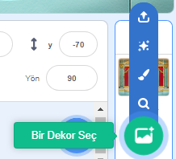
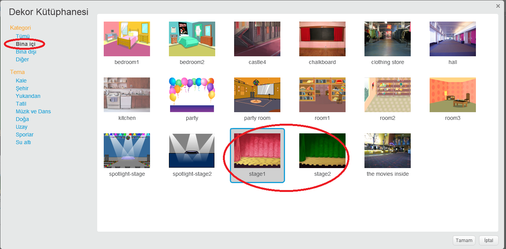

## Sahne

**Sahne**, sağdaki alan ve projenizin hayata geçtiği yerdir. Bunu gerçek bir sahne gibi, bir performans alanı olarak düşünün!

\--- task \--- Şu anda sahne beyaz ve oldukça sıkıcı görünüyor! **Bir Dekor Seç**'e tıklatarak sahnenize bir dekor ekleyin.

 \--- /task \---

\--- task \--- Listenin en üstündeki **Bina içi**'ni tıklayın ve sonrasında tiyatro (theater) dekoruna basın.

 \--- /task \---

\--- task \--- Şimd sahneniz şuna benzer gözükmeli:

 \--- /task \---