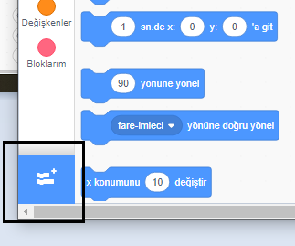
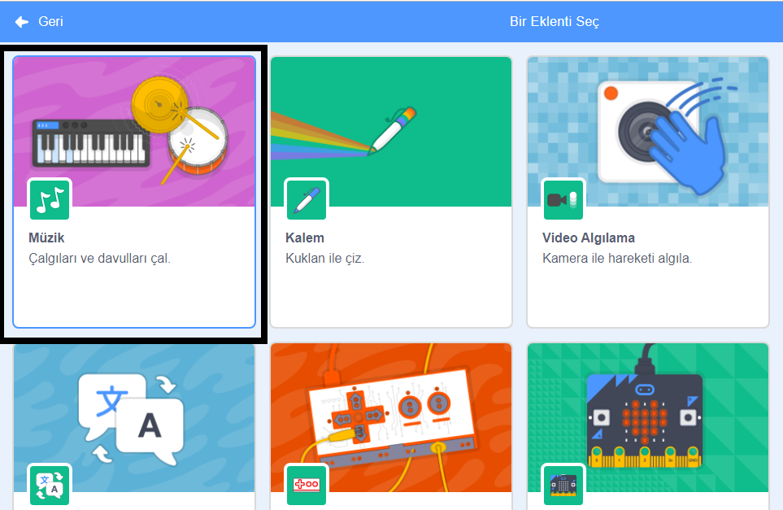
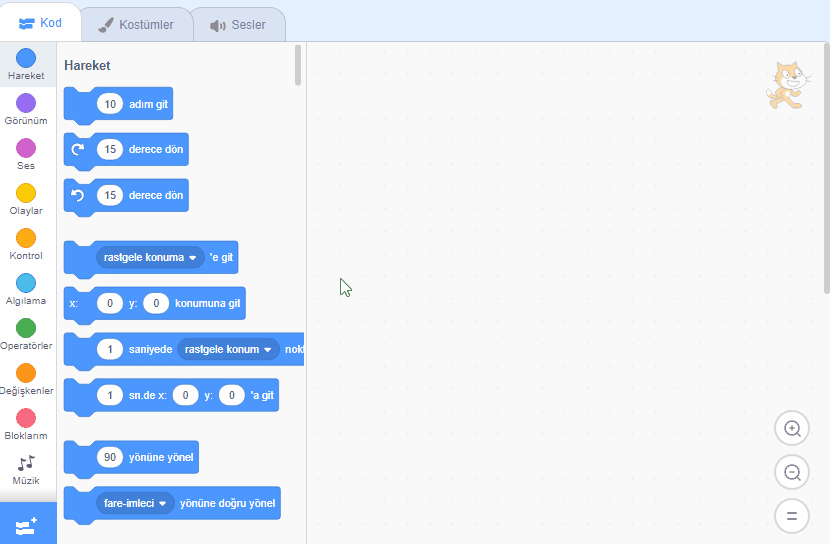

## Davul yapmak

Now you will add code to your drum so that the drum makes a sound when it's clicked.

Kod bloklarını Scripts sekmesinde bulabilirsiniz ve hepsi de renk kodludur!

\--- task \---

First add the **Music** extension so you can play instruments.

Sol alt köşedeki **Eklenti Ekle** düğmesine tıklayın.



Eklemek için **Müzik** uzantısına tıklayın.



\--- /task \---

\--- task \--- Click on the drum sprite, and then drag these two blocks into the code area on the right:

```blocks3
when this sprite clicked
play drum (\(1\) Snare Drum v) for (0.25) beats
```

\--- no-print \---



\--- /no-print \---

Make sure that the blocks are connected together (like LEGO bricks).

\--- /task \---

\--- task \--- Click on the drum to try out your new instrument! \--- /task \---