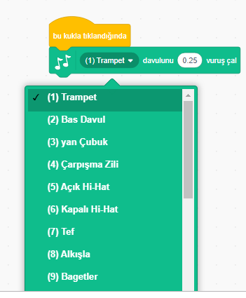
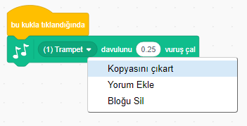

## Meydan Okuma: Davulunuzu geliştirin

Davulun tıklandığında çıkardığı sesi değiştirebilir misiniz?



Ayrıca klavyeden boşluk tuşuna basılınca, davulunuzdan ses çıkarmayı sağlayabilir misiniz? Bunun için `olaylar`{:class="block3events"} bloğunu kullanmanız gerekir:

```blocks3
[boşluk] tuşuna basılınca
```

Mevcut kodunuzu sağ tıklayıp **çoğalt** seçeneğini tıklayarak kopyalayabilirsiniz.

