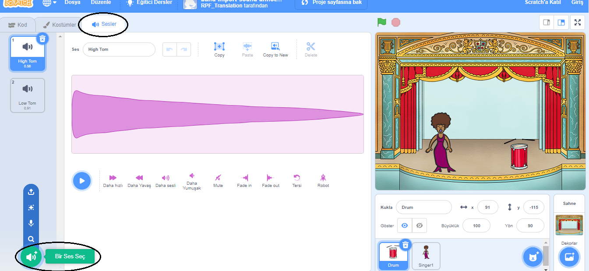
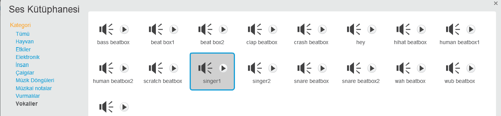

## Bir şarkıcı yapmak

Şimdi müzik grubunuza bir şarkıcı ekleyeceksiniz!

\--- task \---

Sahne Alanı'na bir şarkıcı kuklası ekleyin.


[[[generic-scratch3-sprite-from-library]]]

\--- /task \---

\--- task \---

Şarkıcınızın şarkı söylemeye başlamasından önce şarkıcı kuklasına bir ses eklemeniz gerekir. Şarkıcı kuklanızın seçili olduğundan emin olduktan sonra Sesler sekmesine geçin ve **Bir Ses Seç**'i tıklayın:

 \--- /task \---

\--- task \--- En üstteki listeden **Ses** sekmesine tıklayın ve kuklanıza eklemek için bir ses seçin.

 \--- /task \---

\--- task \--- Sesi kullanmak için, şarkıcı kuklanıza aşağıdaki kod bloklarını ekleyin:

```blocks3
bu kukla tıklandığında
(şarkıcı1) sesini bitene kadar çal
```

\--- /task \---

\--- task \--- Sahnede şarkıcınıza tıklayın ve ne olduğunu görün. Şarkı söylüyor mu? \--- /task \---