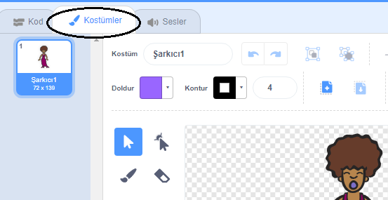
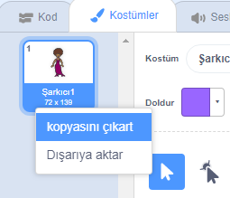
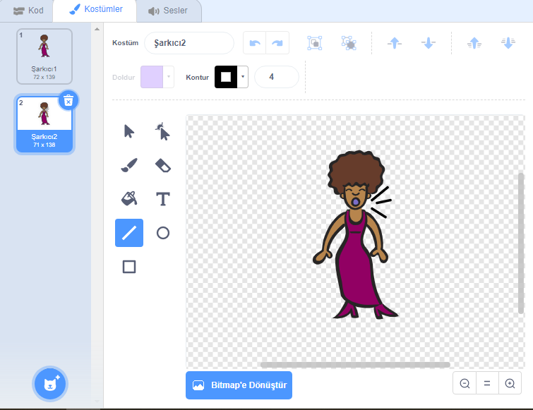
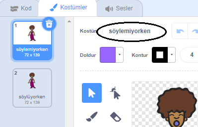

## Kostümler

Şimdi şarkıcınızın şarkı söylüyormuş gibi gözükmesini sağlayacaksınız!

\--- task \--- Yeni bir kostüm yaratarak tıklandığında Şarkıcı kuklanızın görünümünü değiştirebilirsiniz. Kostümler sekmesine tıklayın, şarkıcı kostümünü göreceksiniz.

 \--- /task \---

\--- task \--- Kostüm üzerinde sağ tıklayın ve kostümün bir kopyasını oluşturmak için **çoğalt** seçeneğini tıklayın.

 \--- /task \---

\--- task \--- Yeni kostüme tıklayın ('Şarkıcı2' adlı) ve çizgi aracını seçip şarkıcınız sanki ses çıkarıyormuş gibi çizgiler çizin.

 \--- /task \---

\--- task \--- Kostümlerin isimleri şu anda çok açıklayıcı durmuyor. Kostümlerin adlarını, isim kutularına 'söylemiyor' ve 'söylüyor' şeklinde yazın.

 \--- /task \---

\--- task \--- Artık şarkıcınız için iki farklı kostümünüz var, hangi kostümün görüntüleneceğini seçebilirsiniz! Bu iki kod bloğunu şarkıcı kuklanıza ekleyin:

```blocks3
bu kukla tıklandığında
(söylüyor) kılığına geç
(Şarkıcı1) sesini bitene kadar çal
(söylemiyor) kılığına geç
```

Kostümü değiştirmek için kod blokları, `Görünüm`{: class = "blocklooks"} bölümünde bulunur. \--- /task \---

\--- task \--- Sahnede şarkıcınıza tıklayın. Şarkı söylüyor gibi görünüyor mu? \--- /task \---

\--- task \--- Şimdi davuluna vurulmuş gibi görünmesini sağla!


- Size yardımcı olması için şarkıcı kuklanızın kostümünü değiştirme talimatlarını kullanın.

Yeni kodunuzun çalıştığını test etmeyi unutmayın! \--- /task \---