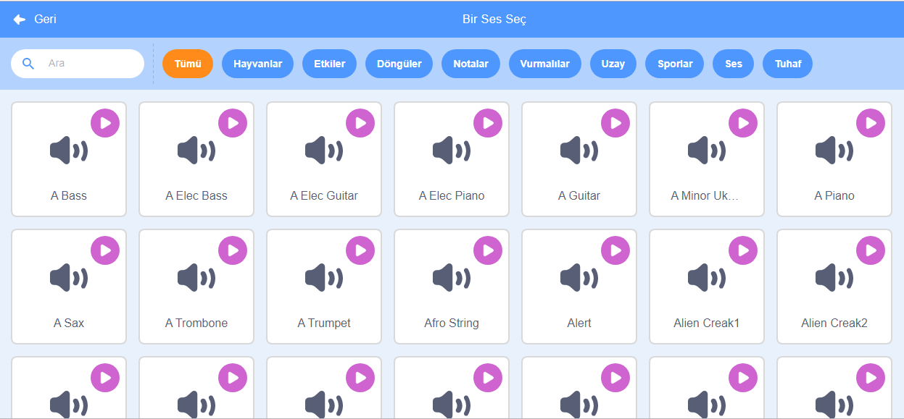
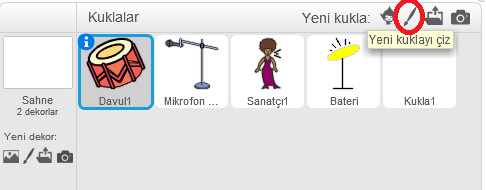
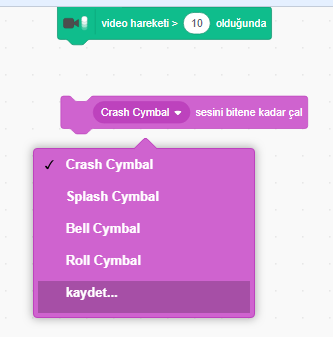

## Meydan Okuma: müzik grubunuzu geliştirin

Kendi müzik grubunuzu oluşturmak için bu projede öğrendiklerinizi kullanın! İstediğiniz enstrümanları oluşturabilirsiniz - fikir edinmek için mevcut enstrüman kuklalarına ve seslere bakın.



```blocks3
bu kukla tıklandığında
Enstrümanı (\(1\) Piyano) yap
(60) notasını (0.25) vuruşunda çal
```

Enstrümanlarınızın o kadar da gerçekçi olmak zorunda değil. Örneğin, keklerden yapılmış bir piyano yapabilirsiniz!


Kütüphaneden daha fazla kukla kullanabilir ve kendi kuklalarınızı da boyayabilirsiniz!



## \--- collapse \---

## title: Kuklam kostümünü değiştirdiğinde neden zıplıyor?

Kendi kuklanızı oluştururken, kukla tıklatılıp kostümünü değiştirirken 'zıpladığını' görebilirsiniz. Bunun nedeni iki kostümün aynı yerde merkezli olmamasıdır.

Bunu düzeltmek için, kukla kostümlerinin merkezlerinin aynı olduğundan emin olun.

\--- /collapse \---

Bir mikrofonunuz varsa, kendi seslerinizi kaydedebilir, hatta müzik enstrümanlarınızı kullanmak için bir web kamerası bile kullanabilirsiniz!

