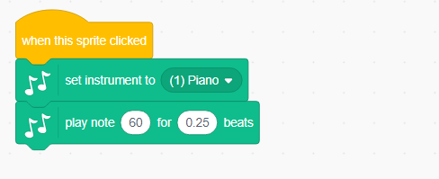

--- challenge ---

## Challenge: створіть власну групу

Використовуйте те, що ви дізналися в цьому проекті, щоб створити власну групу! Ви можете створювати будь-які інструменти, які вам подобаються - перегляньте доступні звуки та інструменти, щоб отримати деякі ідеї.

Ваші інструменти, не повинні бути зрозумілими. Наприклад, ви можете зробити фортепіано, виготовлене з кексів!

Також за допомогою існуючих спрайтів можна створити власний.

--- collapse ---
---
title: Чому мій спрайт "стрибає", коли змінює костюм?
---

+ Створюючи свій власний спрайт, ви можете помітити, що коли ви натискаєте на спрайт, він "стрибає", коли змінює костюм. Це тому, що два костюми не розташовані в одному місці.

Щоб виправити це, натисніть кнопку ** Встановити центр костюмів ** на обох костюмах і переконайтеся, що центр знаходиться в одній точці обох костюмів.

--- /collapse ---

Якщо у вас є мікрофон, ви можете записувати власні звуки або навіть використовувати веб-камеру, щоб користуватися своїми інструментами!

--- /challenge ---