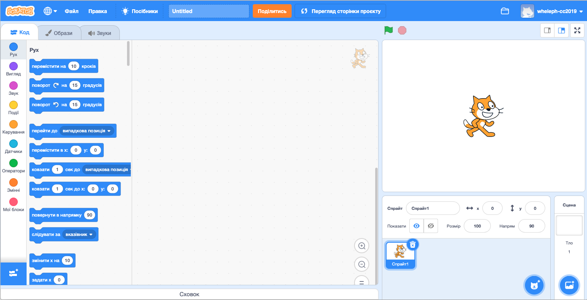
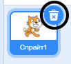
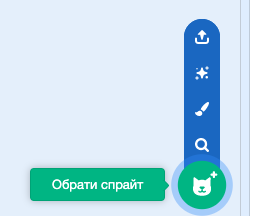
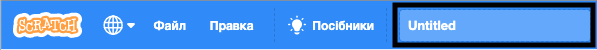
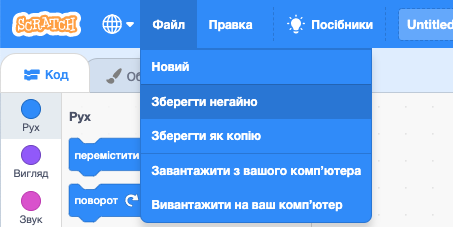

## Спрайти

Перш ніж розпочати, тобі потрібно додати "щось", для чого ти писатимеш програму. У Скретч, це "щось" називають **спрайтами**.

--- task ---

Відкрий новий проєкт Скретч.

**Онлайн:** відкрий новий онлайн проєкт Скретч на [rpf.io/scratch-new](http://rpf.io/scratch-new){:target="_blank"}.

**Офлайн:** відкрий новий проєкт в офлайн-редакторі.

Якщо тобі треба завантажити та встановити офлайн-редактор Скретч, то ти можеш його знайти на [rpf.io/scratchoff](http://rpf.io/scratchoff){:target="_blank"}.

Це виглядатиме так:

--- /task ---

--- task ---

Спрайт кота, який ти бачиш — це талісман Скретч. Він тобі не знадобиться у цій грі, тому позбудься нього, натиснувши на іконку **видалити**.

--- /task ---

--- task ---

Далі клікни **Обрати спрайт**, щоб відкрити бібліотеку всіх спрайтів у Скретч.

--- /task ---

--- task ---

Прокрути вниз, поки не знайдеш спрайт барабана. Клацни на нього для того, щоб додати в свій проєкт.

--- /task ---

--- task ---

Клацни і перетягни барабан вниз Сцени.

--- /task ---

--- task ---

Задай назву свого проєкту, набравши її в текстовому полі вгорі.

Потім клацни на **Файл**, а далі — **Зберегти негайно** для збереження свого проєкта.

Якщо ти не підключений до інтернету, або не маєш облікового запису Скретч, то замість цього ти можеш зберегти копію свого проєкту, натиснувши **Вивантажити на ваш комп’ютер**.

--- /task ---