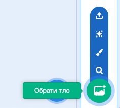
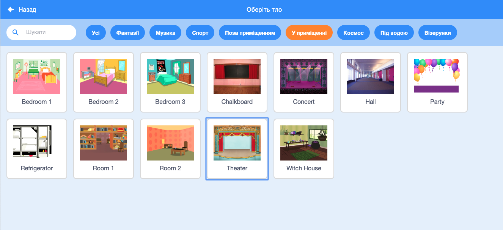

## Сцена

**Сцена** — це область праворуч, де оживає твій проєкт. Вважай, що це місце для виступу так само, як і справжня сцена!

\--- task \---

Наразі сцена біла і виглядає досить нудно! Додай тло, клацнувши на **Обрати тло**.

\--- /task \---

\--- task \---

Клацни на **У приміщенні** у списку вгорі. Далі клікни на тло театру.

\--- /task \---

\--- task \---

Click and drag the drum to the bottom of the Stage.

\--- /task \---

\--- task \---

Your stage should now look similar to this:

\--- /task \---