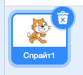

## Спрайти

Перш ніж почати кодування, вам потрібно додати "щось", щоб кодувати. У Скретчі, це "щось" називають ** спрайтами **.

+ Спочатку відкрийте редактор Скретч. Ви можете знайти онлайн-редактор Скретч за адресою <a href="http://jumpto.cc/scratch-new" target="_blank"> jumpto.cc/scratch-new </a>. Це виглядає так:
    
    

+ Спрайт кіт, якого ви можете побачити, - це талісман Скретч. Давайте позбавимось кота, клацнувши на нього правою кнопкою миші, а потім **видалити**.
    
    

+ Далі, натисніть **вибрати спрайт з бібліотеки** щоб відкрити список всіх спрайтів Скретчу.
    
    

+ Прокрутіть вниз, поки не побачите барабанний спрайт. Натисніть на барабан і натисніть ** OK ** щоб додати його до вашого проекту.
    
    

+ Натисніть значок ** зменшити **, а потім кілька разів клацніть по барабані, щоб зробити його меншим.
    
    

Дайте назву вашій програмі, набравши її в текстовому полі в лівому верхньому куті.

Згодом ви можете натиснути на ** Файл **, а потім ** Зберегти зараз **, щоб зберегти ваш проект. Якщо у вас немає облікового запису Скретч, ви можете зберегти копію свого проекту, натиснувши натомість ** Завантажити на свій комп'ютер **.

