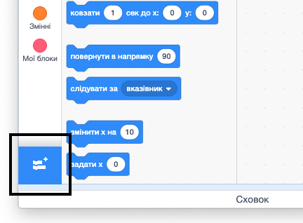
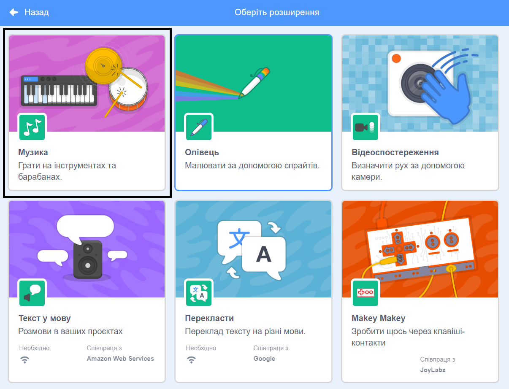

## Створення барабана

Тепер ти додаси код до свого барабана так, щоб він видавав звук, коли на нього клацнули.

Ти можеш знайти блоки коду у вкладці "Код", і всі вони позначені кольорами!

\--- task \---

Спочатку додай розширення **Музика**, щоб можна було грати на інструментах.

Натисни кнопку **Додати розширення** в нижньому лівому куті.



Натисни на розширення **Музика**, щоб додати його.



\--- /task \---

\--- task \---

Клікни на спрайт барабана і перетягни наступні блоки в область коду справа:

```blocks3
when this sprite clicked
play drum (\(1\) Snare Drum v) for (0.25) beats
```

\--- no-print \---


\--- /no-print \---

Переконайся, що блоки з’єднані (як деталі LEGO).

\--- /task \---

\--- task \---

Клікни на барабан, щоб випробувати свій новий інструмент!

\--- /task \---