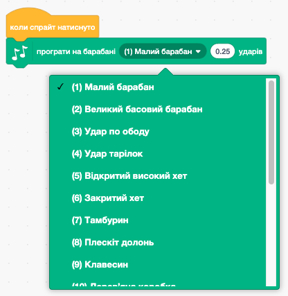
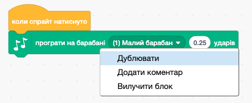

## Завдання: вдоскональ свій барабан

Чи можеш ти змінити звук, який видає барабан, коли на нього натискають?



Чи можеш ти змусити барабан також видавати звук, коли клавіша пропуск натиснута? Тобі потрібно буде використати цей блок із секції `Події`{:class="block3events"}:

```blocks3
when [пробіл v] key pressed
```

Якщо ти хочеш скопіювати існуючий код, клацни правою кнопкою миші по ньому, а потім натисни на **Дублювати**.

