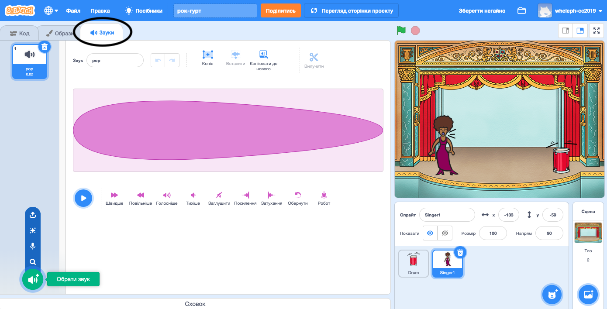
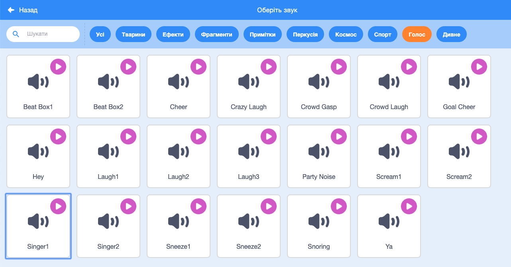

## Створення співачки

Тепер ти додаси до своєї групи співачку!

\--- task \---

Додай спрайт співачки до своєї Сцени.


[[[generic-scratch3-sprite-from-library]]]

\--- /task \---

\--- task \---

Перш ніж зробити так, щоб вона заспівала, тобі потрібно додати звук до спрайта співачки. Переконайся, що ти вибрав спрайт співачки, а потім клацни по вкладці "Звуки" і натисни кнопку **Обрати звук**:



\--- /task \---

\--- task \---

Клікни на **Голос** у верхньому списку, і вибери звук для свого спрайта.



\--- /task \---

\--- task \---

Для використання звуку, додай наступні блоки коду до спрайта співачки:

```blocks3
when this sprite clicked
play sound (singer1 v) until done
```

\--- /task \---

\--- task \---

Клацни на свою співачку на сцені, щоб перевірити, що трапиться. Вона співає?

\--- /task \---