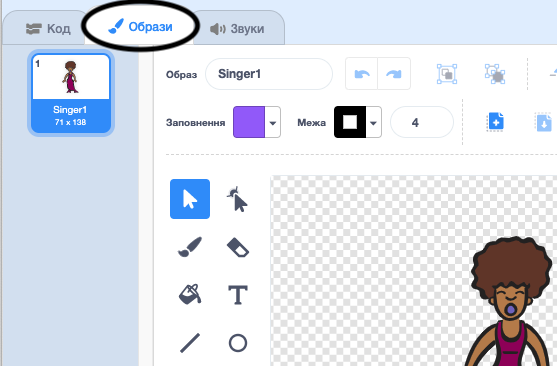
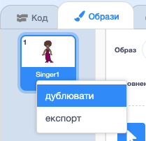
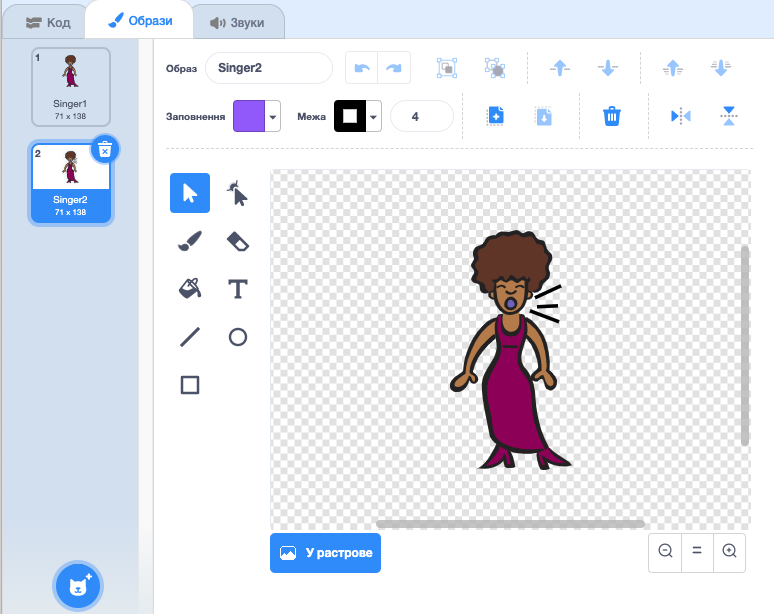
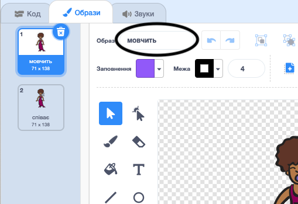

## Образи

Тепер ти зробиш так, щоб співачка виглядала так, ніби співає!

\--- task \---

Ти можеш змінювати вигляд співачки, коли на неї клікають, створивши новий образ. Клікни на вкладку "Образи", і ти побачиш образ співачки.



\--- /task \---

\--- task \---

Клікни правою кнопкою миші на образ і клацни **дублювати**, щоб створити його копію.



\--- /task \---

\--- task \---

Клікни на новий образ (що називається "Singer2"), а потім вибери інструмент для ліній, і намалюй їх так, ніби співачка видає звуки.



\--- /task \---

\--- task \---

Зараз назви образів не дуже корисні. Зміни імена образів на "мовчить" та "співає" у відповідних текстових полях.



\--- /task \---

\--- task \---

Тепер, коли в тебе є два різних образи для твоєї співачки, ти можеш вибирати який з них відображатиметься! Додай ці два блоки коду до свого спрайта співачки:

```blocks3
коли спрайт натиснуто
+змінити образ на (співає v)
відтворити звук (singer1 v) до кінця
+змінити образ на (мовчить v)
```

Блоки коду для зміни образів знаходяться в секції `Вигляд`{:class="block3looks"}.

\--- /task \---

\--- task \---

Клікни на свою співачку. Чи виглядає вона так, ніби співає?

\--- /task \---

\--- task \---

А тепер зроби так, щоб барабан виглядав так, ніби по ньому б’ють!


- Використовуй інструкції для зміни образу співачки як зразок.

Не забудь перевірити, чи працює твій новий код!

\--- /task \---