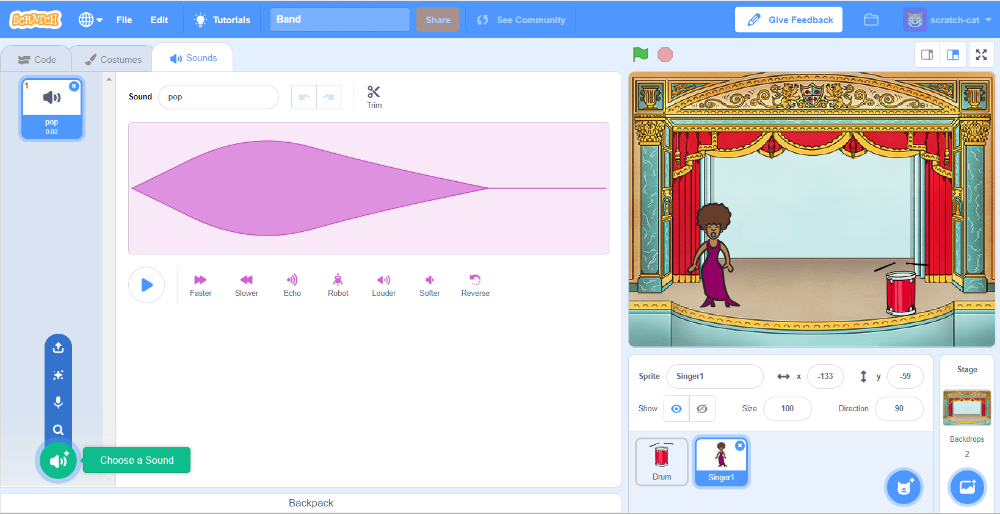

## Роблячи виконавця

Давайте додамо виконавця до вашої групи!

+ Додайте ще два спрайта на вашу сцену: виконавця та мікрофон.
    
    

+ Перш ніж ваш виконавець зможе співати, вам потрібно додати звук вашому спрайту. Переконайтеся, що ви вибрали свого виконавця, потім натисніть вкладку Звуки та натисніть ** Вибрати звук із бібліотеки **:
    
    

+ Якщо натиснути кнопку ** Вокал ** на лівій стороні, ви зможете вибрати відповідний звук для вашого спрайту.
    
    

+ Тепер, коли звук був доданий, ви можете додати цей код до свого виконавця:
    
    ```blocks
        коли клацаєте на спрайт
        відіграти звук [singer1 v] поки не завершиться
    ```

+ Натисніть на свою співачку і подивіться, що станеться. Вона співає?