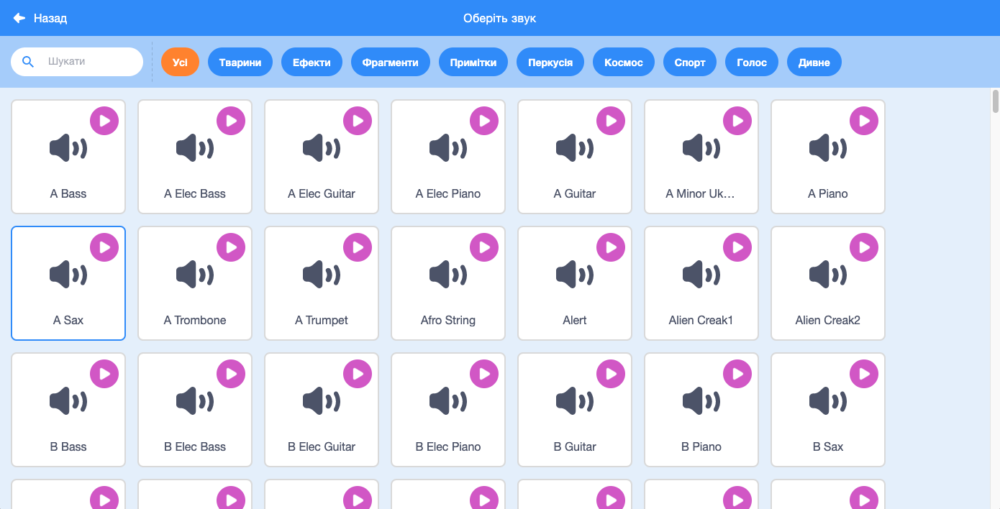
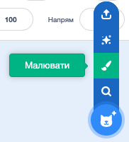

## Завдання: покращи свій гурт

Використай все, що було вивчено в цьому проєкті, для створення власного гурту! Ти можеш створювати будь-які інструменти, які забажаєш — для натхнення переглянь доступні спрайти інструментів та звуки.



```blocks3
when this sprite clicked
set instrument to (\(1\) Piano v)
play note (60) for (0.25) beats
```

До речі, твої інструменти необов’язково мають бути реалістичними. Наприклад, ти можеш зробити піаніно із кексів!


Ти можеш використовувати більше спрайтів з бібліотеки, а також можеш намалювати власні!



--- collapse ---
---
title: Чому мій спрайт "підстрибує", коли змінює костюм?
---

При створенні власного спрайту ти можеш помітити, що коли ти на нього клікаєш, то він "підстрибує" при зміні образу. Це відбувається тому, що центри образів знаходяться в різних місцях.

Щоб виправити це, переконайся, що центри образів спрайта знаходяться в одному місці.

--- /collapse ---

Якщо в тебе є мікрофон, то ти можеш записувати свої власні звуки, та навіть використовувати веб-камеру, щоб грати на інструментах!

