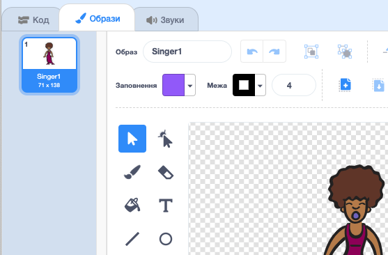
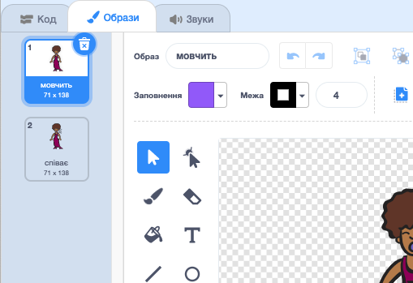

## Костюми

Давайте зробимо так, щоб співачка виглядала наче вона співає!

+ Ви також можете змінити вигляд спратйту вашої співачки, натиснувши на нього та створивши новий костюм. Натисніть вкладку Костюми, і ви побачите зображення співачки.
    
    

+ Клацніть правою кнопкою миші на костюмі та натисніть ** дублікат ** щоб створити копію костюма.
    
    

+ Натисніть на новий костюм (називається 'Співак2') і потім виберіть інструмент "лінія" та накресліть лінії, щоб здавалося, що ваша співачка робить звук.
    
    

+ Назви костюмів на даний момент не дуже корисні. Перейменуйте два костюми так, щоб вони називались "не співаючий" та "співаючий", набравши в текстове поле нове ім'я кожного костюма.
    
    

+ Now that you have two different costumes for your singer, you can choose which costume is displayed! Add these two blocks to your singer:
    
    
    
    The code block for changing the costume is in the `Looks`{:class="blocklooks"} section.

+ Click on your singer. Does she look like she is singing?