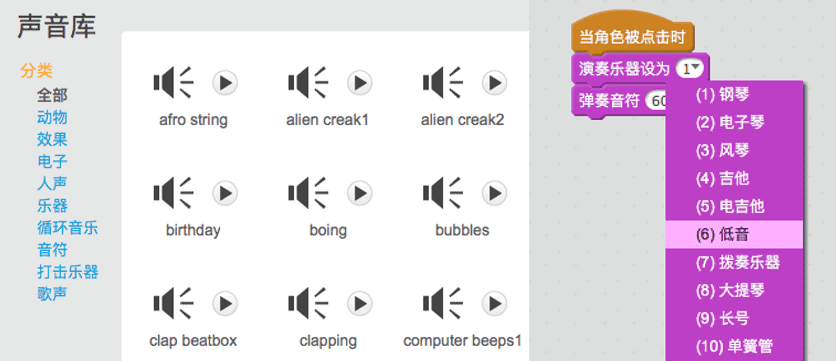
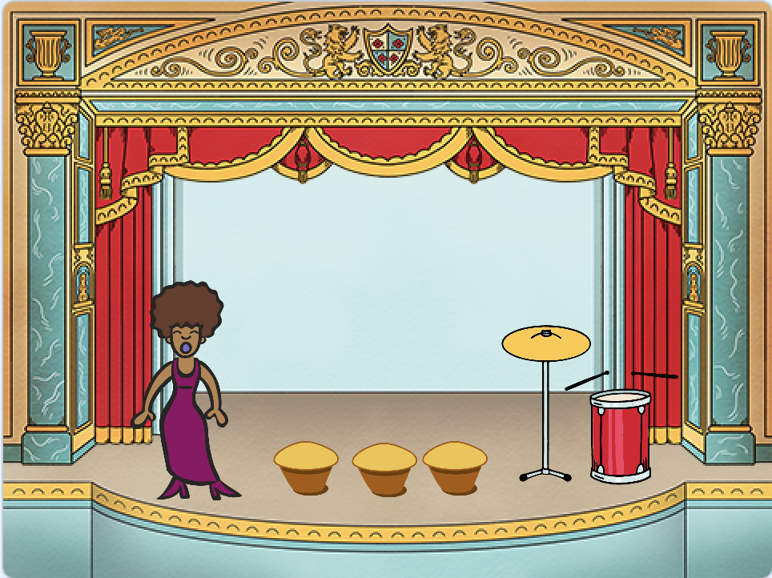
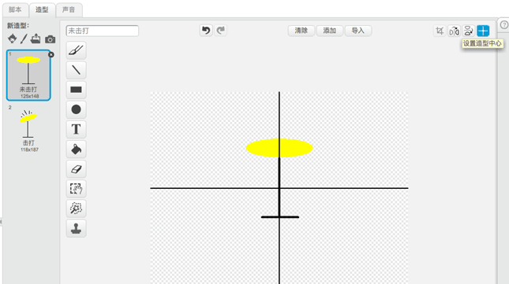
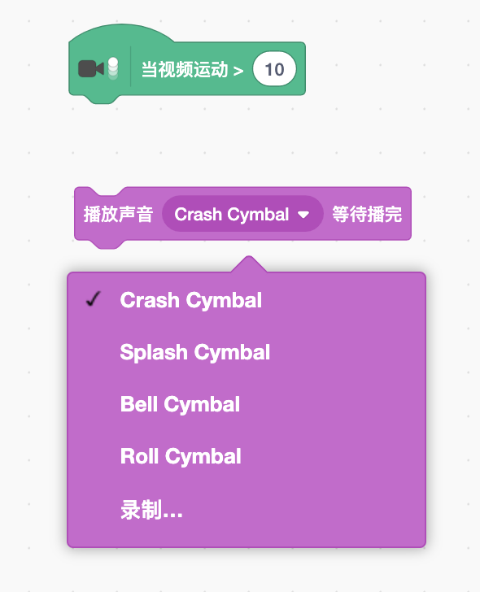

--- challenge ---

## 挑战：组建你自己的乐队

利用你在本项目学到的知识创建一个属于你自己的乐队！你可以创建任何你喜欢的乐器--看一下声音库和造型库都有哪些声音和乐器，希望可以给你一些灵感。

你的乐器不一定非要十分合理。比如，你可以用松饼来做钢琴。

除了使用现有角色，你也可以画自己的角色。

--- collapse ---
---
title: 当角色切换造型时为什么会“跳一下？
---

+ 当你创建自己的角色时，你可能会发现当你点击角色，他在切换造型时会“跳一下”。这是因为两个造型的中心不在同一位置上。

要修复这个问题，对两个造型都点击**设置造型中心**按钮，确保两个造型的中心点在同一点上。

--- /collapse ---

如果你有麦克风，你可以录制自己的声音，甚至用摄像头击打你的乐器！

--- /challenge ---