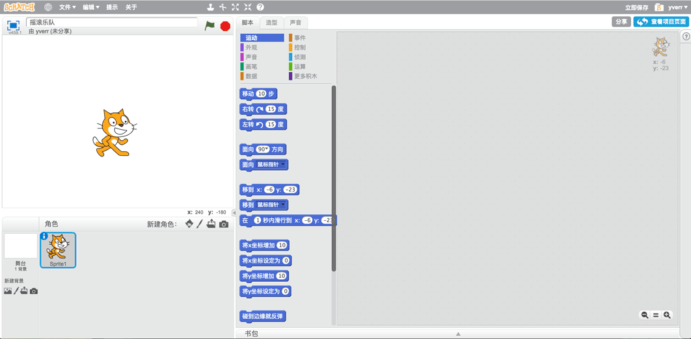
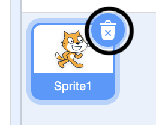
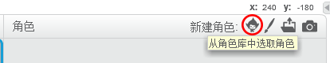
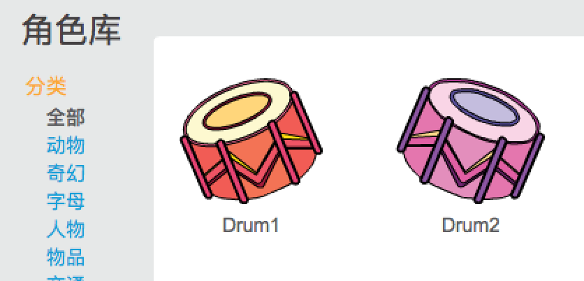
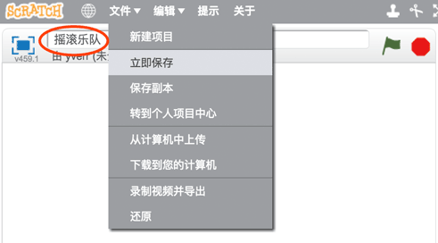

## 角色

在你开始编程之前，你需要添加一个“东西”到程序里。在Scratch中，这个“东西”叫做**角色**。

\--- task \---

创建一个新的Scratch项目

**在线：**在[rpf.io/scrath-new](http://rpf.io/scratch-new){:target="_blank"}打开一个新的Scratch在线项目 。

**离线：**在离线编辑器中打开一个新项目。

如果您需要下载并安装Scratch离线编辑器，可以在[ rpf.io/scratchoff ](http://rpf.io/scratchoff)中获取 {：target="_blank"}。

它看起来像这样：

\--- /task \---

\--- task \---

The cat sprite that you can see is the Scratch mascot. You don't need it for this game, so get rid of it by clicking on the X in the corner.

\--- /task \---

\--- task \---

接下来，点击**从角色库中选取角色**，打开所有Scratch自带角色列表。

\--- /task \---

\--- task \---

向下滚动直到看到一个鼓（drum）的角色。点击鼓将其添加到你的项目中。

\--- /task \---

\--- task \---

Give your program a name by typing into the text box at the top.

Then click on **File**, and then on **Save now** to save your project.

If you are not online or don't have a Scratch account, you can save a copy of your project by clicking on **Save to your computer** instead.

\--- /task \---