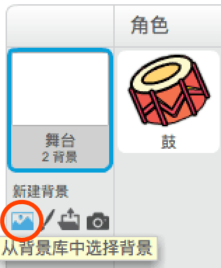
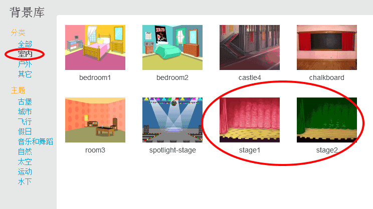

## 舞台

**舞台**在左侧区域，它是为你的项目注入生命的地方。将它想象成一个表演区域，就像现实中的舞台一样！

--- task ---

目前，舞台是白色的，什么都没有太无聊了！单击 **选择一个背景**图标为其添加背景。

--- /task ---

--- task ---

点击列表顶部的 **室内** 。然后点击剧院背景。

--- /task ---

--- task ---

你的舞台现在应该看起来像这样：

--- /task ---