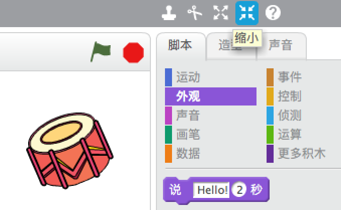

## 角色

在你开始编码之前，你需要添加一个“东西”来编码。在Scratch中，这个“东西”叫做**角色**。

+ 首先，打开Scratch编辑器。你可以在<a href="http://jumpto.cc/scratch-new" target="_blank">jumpto.cc/scratch-new</a>找到在线版Scratch编辑器。如下图：
    
    

+ 你看到的小猫角色是Scratch的吉祥物。让我们右键点击它，然后点击**删除**来清除掉这个角色。
    
    

+ 接下来，点击**从角色库中选取角色**，打开所有Scratch自带角色列表。
    
    

+ 向下滚动直到你看到鼓角色。点击选择其中的一个鼓，然后点击**确定**将鼓添加到项目中。
    
    

+ 选择**缩小**图标，然后点击几次鼓，将它缩小一点。
    
    

在窗口左上角的文本框中输入你想给你的程序起的名字。

接着你可以点击**文件**然后点击**保存**来保存你的项目。 如果你没有Scratch账号，你可以点击**下载到您的计算机**将项目保存到本地。

