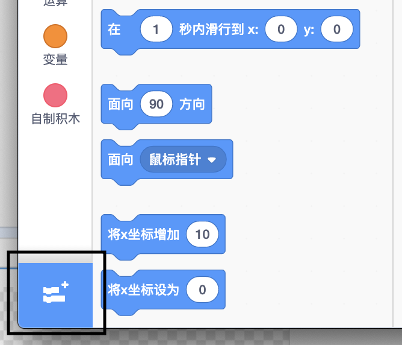
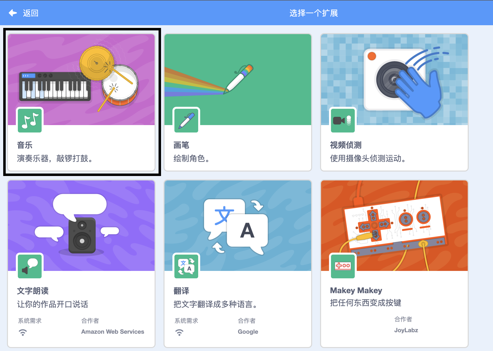

## 制作一面鼓

现在，您将为鼓添加代码，以便在点击鼓时发出声音。

你可以在脚本选项卡中找到所有代码块，他们都用颜色做了区分。

--- task ---

首先添加**音乐**扩展，以便您可以演奏乐器。

单击左下角的 **选择一个扩展** 按钮。



点击 **音乐** 扩展以添加它。



--- /task ---

--- task ---

点击鼓，然后将这两个代码块拖到右边的代码区：

```blocks3
当角色被点击
击打(\(1\) 小军鼓 v)(0.25) 节拍
```

--- no-print ---


--- /no-print ---

确保代码块是连接在一起的（就像乐高积木那样）。

--- /task ---

--- task ---

点击鼓来试试你的新乐器！

--- /task ---