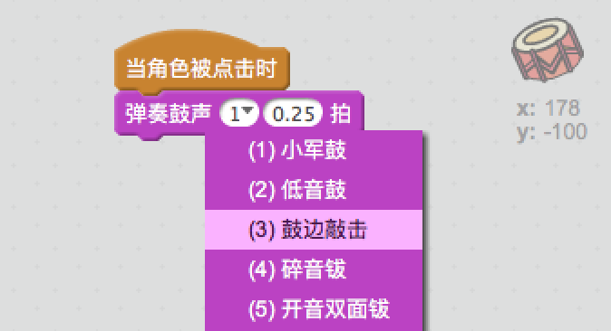
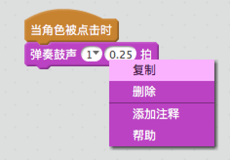

## 挑战：改进你的鼓

你能改变鼓敲击时发出的声音吗？



Can you also get the drum to make a sound when the space bar is pressed? You'll need to use this `event`{:class="block3events"} block:

```blocks3
当按下 [空格键 v]
```

If you want to copy your existing code, right-click on it and then click on **duplicate**.

