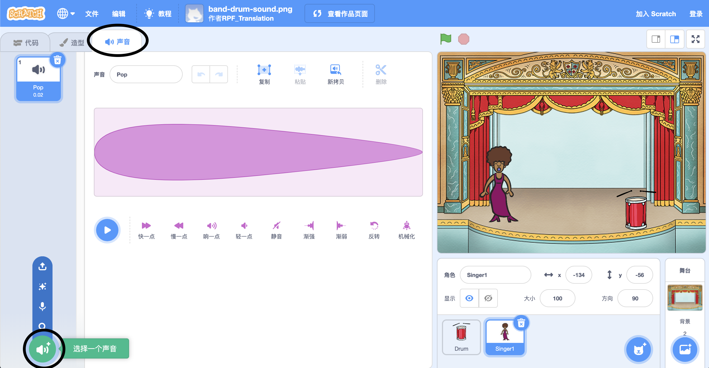
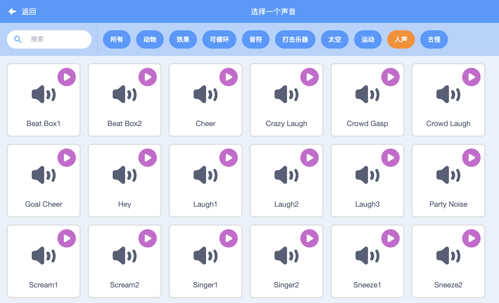

## 创建一个歌手

现在你将为你的乐队添加一名歌手！

\--- task \---

将Singer1角色添加到舞台中。


[[[generic-scratch3-sprite-from-library]]]

\--- /task \---

\--- task \---

在你让歌手唱歌之前，你需要为你的Singer角色添加声音。 确保您已选择Singer角色，然后点击”声音“选项卡，然后点击 **选择一个声音**：



\--- /task \---

\--- task \---

单击列表顶部点击 **人声** ，然后选择要为角色添加的声音。



\--- /task \---

\--- task \---

要使用声音，请将以下代码块添加到Singer角色中：

```blocks3
当角色被点击
播放声音 (Singer1 v) 等待播完
```

\--- /task \---

\--- task \---

在舞台上点击你的歌手，看看会发生什么。她会唱歌吗？-

\--- /task \---