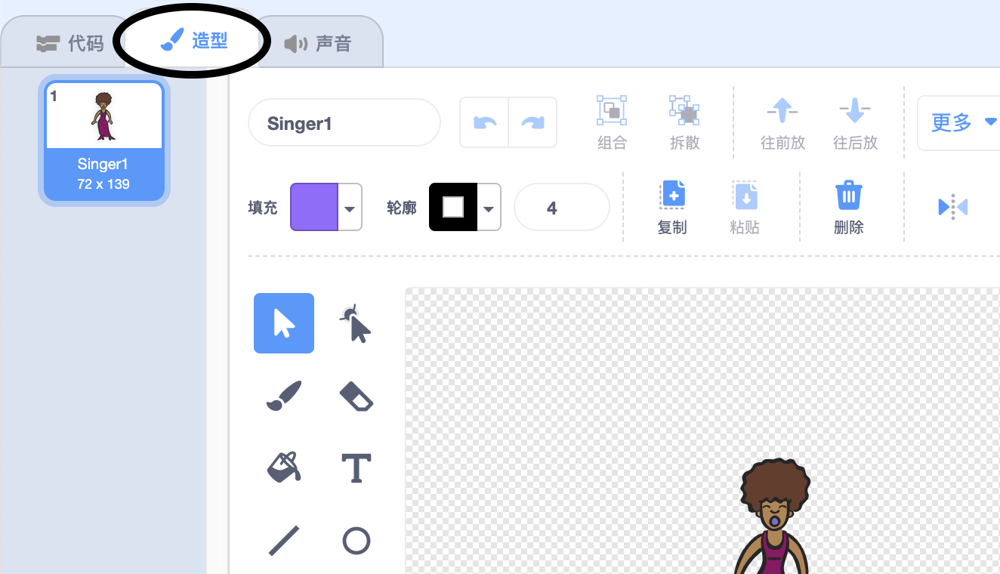
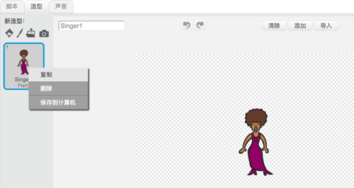
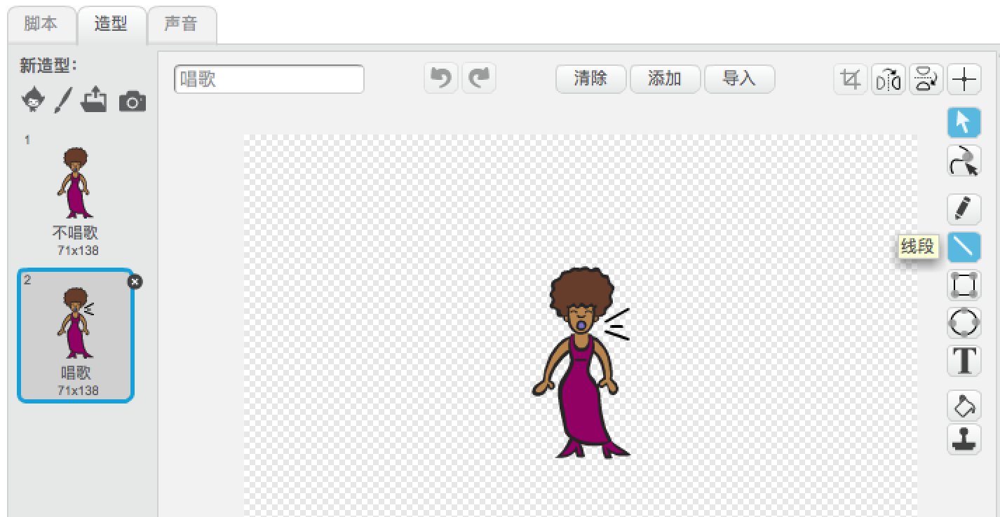
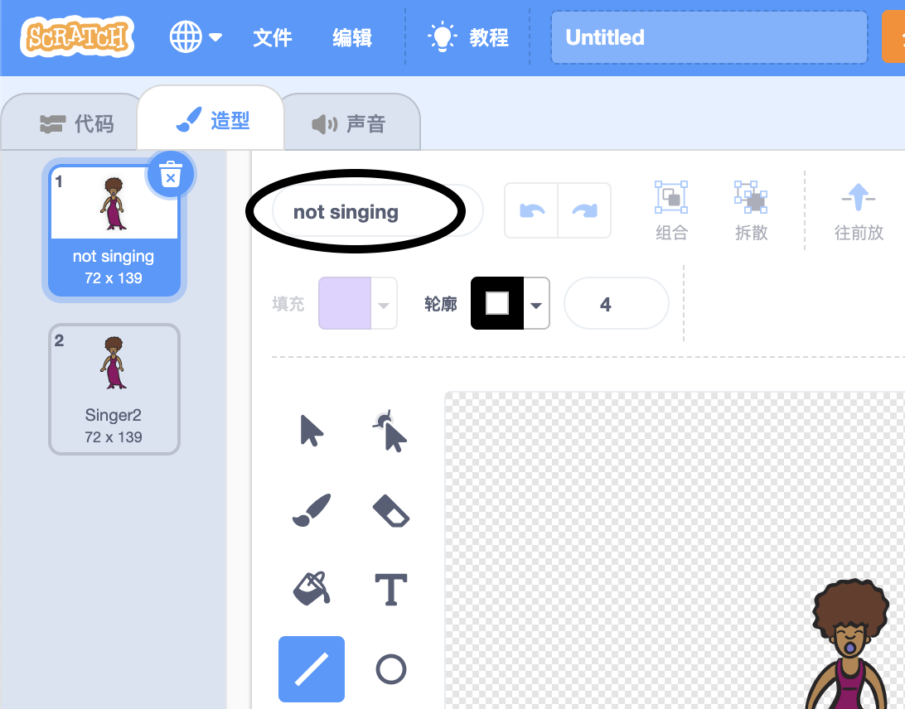

## 造型

现在你要让你的歌手看起来像她在唱歌！

\--- task \---

你可以通过创造一个新的造型来改变你的歌手在点击时的样子。点击”造型“选项卡，你会看到歌手的造型。



\--- /task \---

\--- task \---

右键点击造型，然后点击 **复制** 来复制当前的造型。



\--- /task \---

\--- task \---

点击新的造型（称为'Singer2'），然后选择线条工具并画几条线，这样看起来你的歌手正在发出声音。



\--- /task \---

\--- task \---

目前造型的名称不是很有意义。在造型旁边的文本框中，将其名称更改为“不唱歌”和“唱歌”。



\--- /task \---

\--- task \---

现在您的歌手有两种不同的造型，您可以选择显示哪个造型！将这两个代码块添加到Singer角色中：

```blocks3
当角色被点击
+换成(唱歌 v) 造型
播放声音(singer1 v) 等待播完
+换成(不唱歌 v) 造型
```

更改造型的代码块位于 `外观`{:class="block3looks"}部分。

\--- /task \---

\--- task \---

在舞台上点击你的歌手。她看起来像是在唱歌吗？

\--- /task \---

\--- task \---

现在让你的鼓看起来像是在被击打！


- 利用关于更改角色造型的说明来帮助你。

记得要测试你的新代码是否正常工作！

\--- /task \---