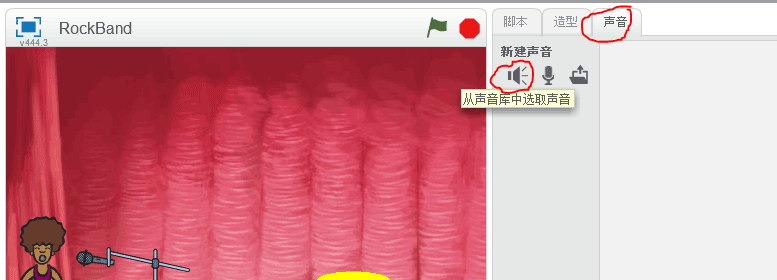

## 创建一个歌手

让我们为乐队添加一位歌手!

+ 在舞台上添加另外两个角色：歌手和麦克风。
    
    

+ 要想让歌手歌唱，你需要为你的角色添加声音。 确认你选中了你的歌手，然后点击声音选项卡，并点击**从声音库中选取声音**：
    
    

+ 点击左侧的**声乐**选项卡为歌手选择一个合适的声音：
    
    

+ 现在声音已经添加，我们可以为歌手添加如下代码：
    
    ```blocks
        当角色被点击
        播放音效 [singer1 v] 到底
    ```

+ 点击你的歌手看看会发生什么。她唱歌了吗？
