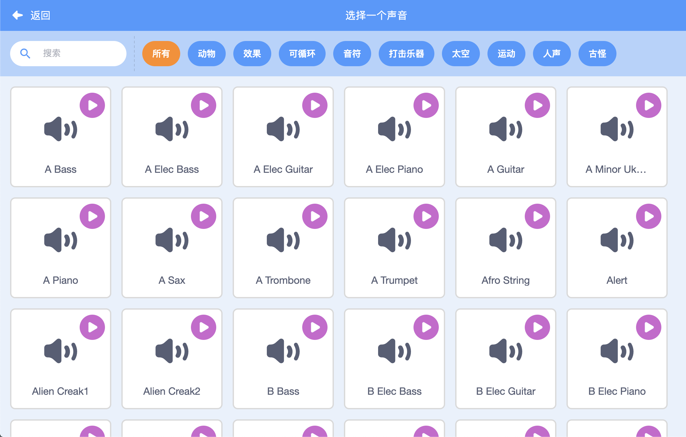

## 挑战：改进你的乐队

利用你在本项目学到的知识创建一个属于你自己的乐队！你可以创建任何你喜欢的乐器--看一下声音库和角色库都有哪些声音和乐器，希望可以给你一些灵感。



```blocks3
当角色被点击
将乐器设为(\(1\) 钢琴 v)
播放音符(60)(0.25) 拍
```

不过，您的乐器不一定要现实。例如，您可以用松饼制成一架钢琴！


您可以从库中选择更多的角色，也可以绘制自己的角色！


## \--- collapse \---

## title: 当角色切换造型时为什么会“跳一下？

当你创建自己的角色时，你可能会发现当你点击角色，他在切换造型时会“跳一下”。这是因为两个造型的中心不在同一位置上。

要解决此问题，请确保角色造型的中心在一个位置上。

\--- /collapse \---

如果您有麦克风，您可以录制自己的声音，甚至可以使用网络摄像头来敲击您的乐器！

