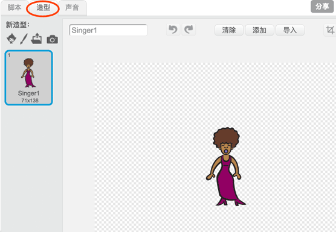
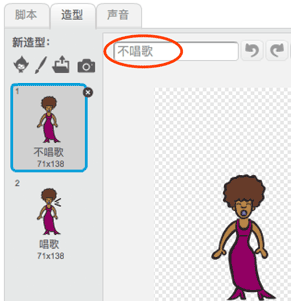
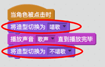

## 造型

让我们让歌手看起来像正在唱歌！

+ 你也可以通过新建造型改变歌手的外观。点击造型选项卡，你会看到歌手的图片。
    
    

+ 右键点击造型并点击复制，复制一份造型。
    
    

+ 点击新建的造型（名叫'歌手2'），然后选择选择直线工具画几条线让歌手看起来正在唱歌。
    
    

+ 目前造型的名字没有什么含义。在每个造型的名字输入框中输入造型的新名字，将两个造型的名字改为'不唱歌' 和 '唱歌'。
    
    

+ 现在你为歌手准备了2个不同造型，你可以选择显示哪个造型！为歌手加入下面两句代码：
    
    
    
    切换造型的代码块在 `外观`{:class="blocklooks"} 分区中。

+ 点击你的歌手。她看起来像正在唱歌吗？