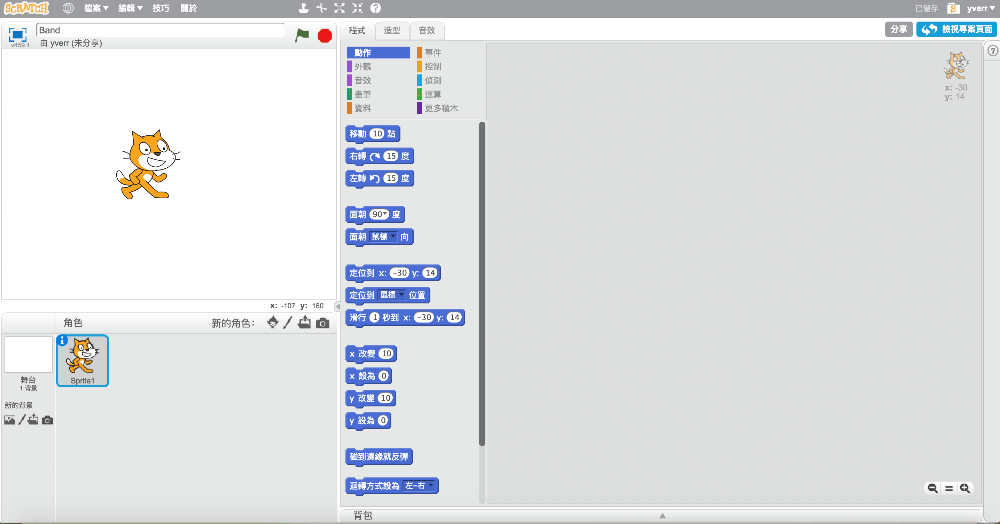
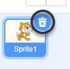
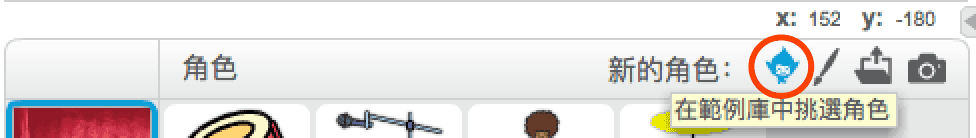
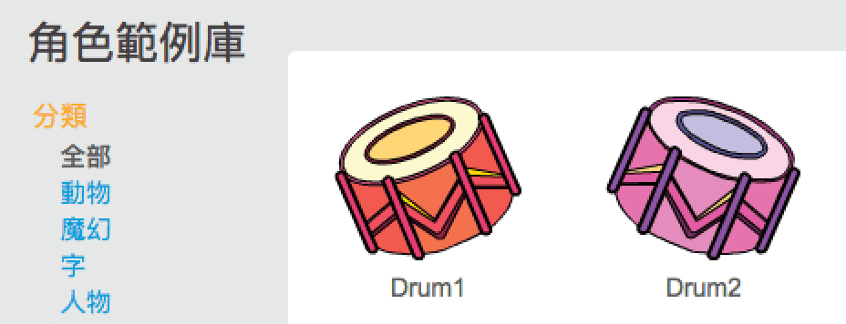
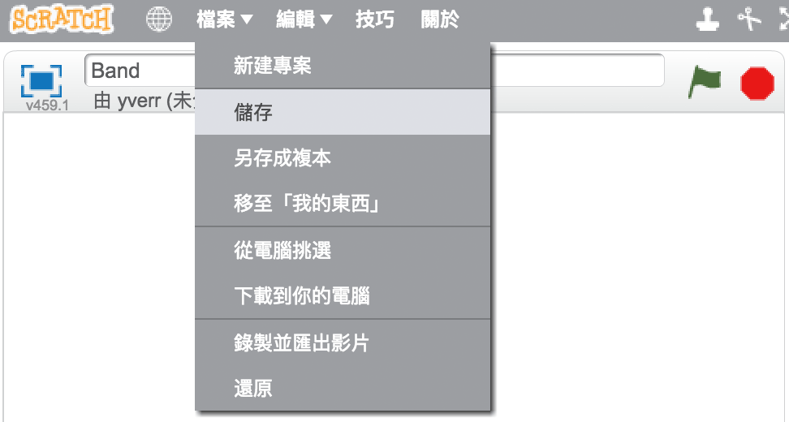

## 角色

在你開始寫程式前，需要先添加一個要編程的「東西」，在 Scratch 裡，這些「東西」在**英文稱為 sprites，中文稱為角色**。

\--- task \---

建立一個新的 Scratch 專案。

**線上版：**你可以連結 [rpf.io/scratch-new](http://rpf.io/scratch-new){:target="_blank"} 以新建專案。

**離線版：**在離線編輯器的工作列中開啟選單並點擊新建專案。

如果你需要 Scratch 離線版編輯器，可以連結到 [rpf.io/scratchoff](http://rpf.io/scratchoff){:target="_blank"}。

它看起來會像這樣：

\--- /task \---

\--- task \---

首先你會看到一隻貓，這個角色是 Scratch 的代表吉祥物。在這個遊戲裡你不需要牠，因此你可以在角色的縮圖區上點擊**垃圾桶**圖示來刪除牠。

\--- /task \---

\--- task \---

接下來，點擊**選個角色**以打開範例角色庫。

\--- /task \---

\--- task \---

滾動頁面直到看到 drum（鼓）。在角色圖案上點一下就可以把它添加到專案。

\--- /task \---

\--- task \---

把鼓拖曳到舞台比較下方的位置。

\--- /task \---

\--- task \---

在工作列上的文字方塊裡，為你的程式專案命名。

接著點擊**檔案**，然後從選單中選擇**儲存**以保存專案。

如果你是在離線狀態，或者你沒有 Scratch 帳戶，可以把檔案**下載到你的電腦**。

\--- /task \---