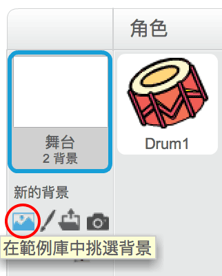
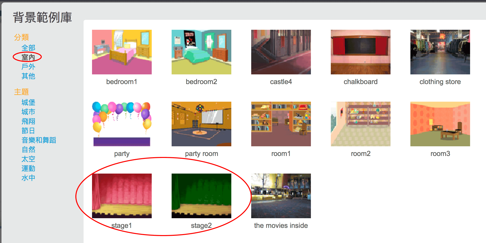

## 舞台

在畫面右側是能讓你的專案運作的地方，**英文名稱是 Stage，中文叫舞台**。把它想像成一個表演區，就像現實生活中的舞台！

\--- task \---

一開始舞台會是白色的，看起來有些單調，**選個背景**吧！

\--- /task \---

\--- task \---

點擊範例庫最上方的**室內**，接著點擊 Theater（劇院）。

\--- /task \---

\--- task \---

Click and drag the drum to the bottom of the Stage.

\--- /task \---

\--- task \---

Your stage should now look similar to this:

\--- /task \---