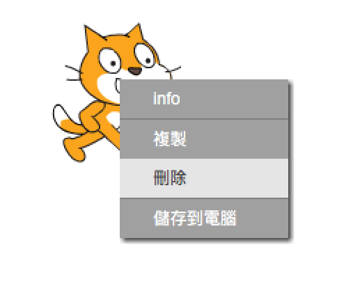
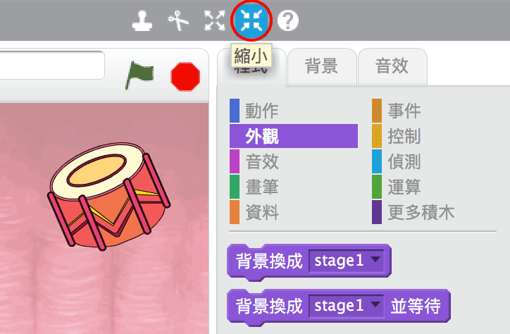

## 角色

在你開始編碼之前，你需要添加一個'東西'來編碼。在Scratch中，這些'東西'被稱為 **角色**。

+ 首先，打開Scratch編輯器。你可以在 <a href="http://jumpto.cc/scratch-new" target="_blank">jumpto.cc/scratch-new</a>找到在線Scratch編輯器。它看起來像這樣：
    
    

+ 你看到的小貓角色是Scratch的吉祥物。讓我們通過右鍵點擊它，然後點擊 **刪除**來移除它。
    
    

+ 接下來，單擊 **在範例庫中挑選角色** 打開所有Scratch角色的列表。
    
    

+ 向下滾動，直到看到鼓角色。點擊鼓，然後點擊 **確定** 將其添加到您的項目中。
    
    

+ 單擊 **縮小** 圖標，然後單擊鼓幾次使其變小。
    
    

在左上角的文本框中輸入一個名稱，為您的程序命名。

然後，您可以點擊 **檔案** ，然後點擊 **立即保存** 以保存您的項目。 如果您沒有Scratch帳戶，可以通過單擊 **下載到您的電腦** 來保存項目的副本。

