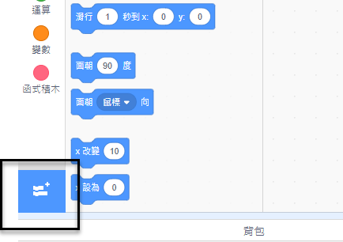
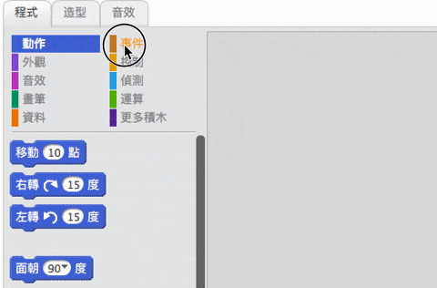

## 製造一個鼓

現在要為鼓編寫一些程式，當你用滑鼠點擊鼓的時候能發出聲音。

你可以在程式頁籤裡看到程式積木，這些積木會用顏色來分類！

--- task ---

先添加**音樂**擴展，這樣子你才可以演奏樂器的聲音。

單擊左下角的**添加擴展**按鈕。



點擊名為**音樂**的擴展就可以加入新的程式積木。


--- /task ---

--- task ---

點擊鼓這個角色，然後將這兩個積木拖曳到右邊的程式工作區。

```blocks3
當角色被點擊
演奏節拍 ( \(1\)軍鼓 v) (0.25) 拍
```

--- no-print ---



--- /no-print ---

檢查你的積木有沒有拼在一起（就像樂高積木那樣）。

--- /task ---

--- task ---

在舞台上點一下鼓，試試你做的新樂器！

--- /task ---