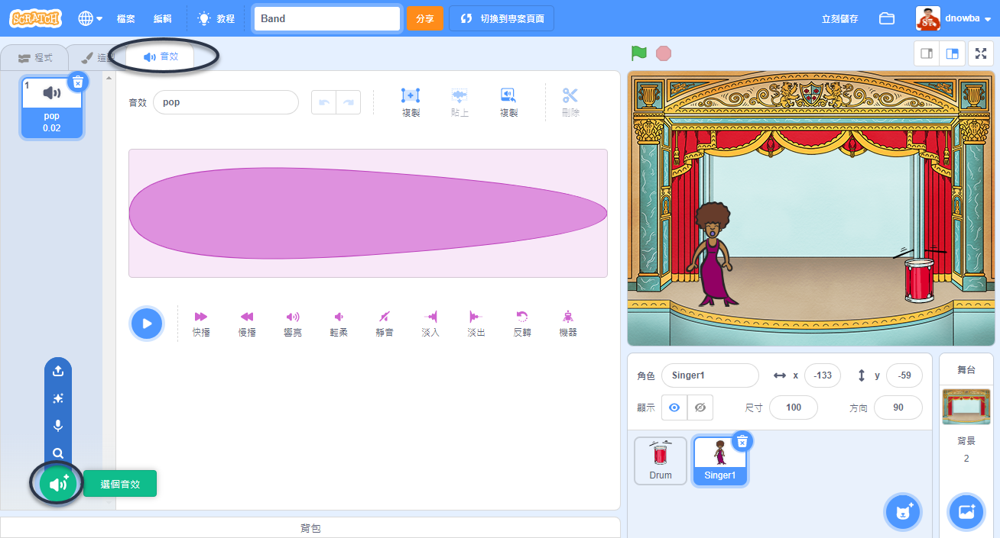
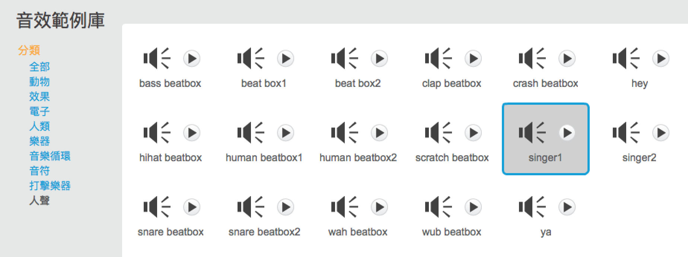

## 製造一個歌手

現在來幫你的樂隊添加一名歌手！

\--- task \---

添加一個歌手角色到你的舞台。


[[[generic-scratch3-sprite-from-library]]]

\--- /task \---

\--- task \---

在你讓歌手唱歌之前，你需要為你的歌手角色添加聲音。 檢查你選的是不是歌手角色，然後切換到音效頁籤，再點擊**選個音效**：



\--- /task \---

\--- task \---

點擊範例庫最上方的**人聲** ，然後選擇一個要添加到角色的聲音。



\--- /task \---

\--- task \---

要使用音效，請添加以下程式積木到你的歌手角色裡：

```blocks3
當角色被點擊
播放音效 (Singer1 v) 直到結束
```

\--- /task \---

\--- task \---

點擊舞台上的歌手，看看會發生什麼，她唱歌了嗎？

\--- /task \---