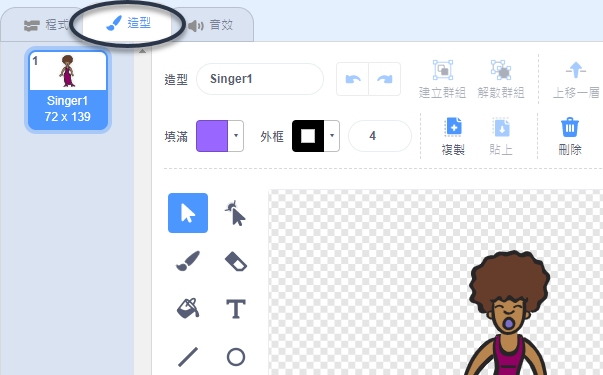
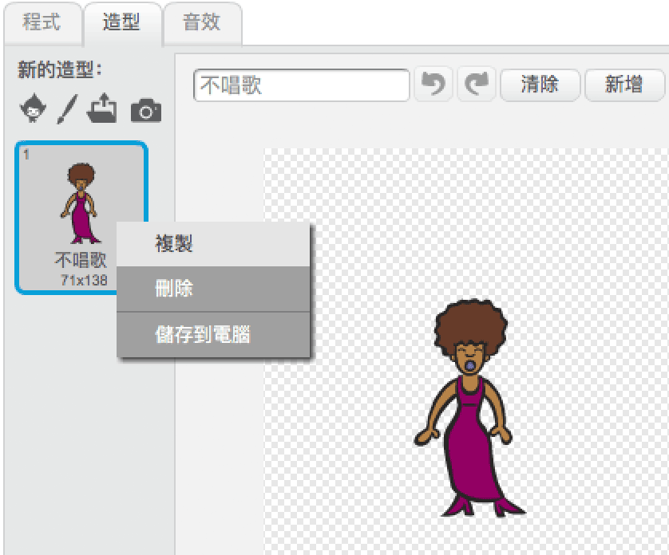
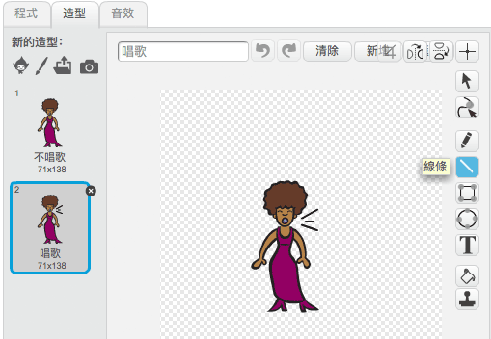
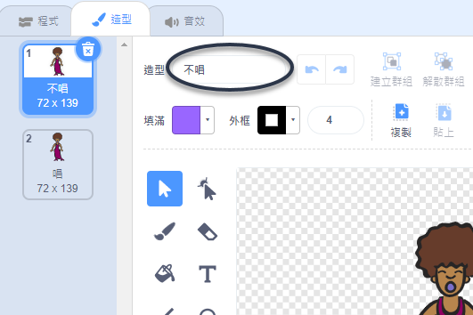

## 造型

現在讓你的歌手看起來像真正在唱歌！

\---任務\--- 你可以通過創造一個新的服裝來改變你的歌手精靈在點擊時的樣子。點擊服裝標籤，你會看到歌手服裝。

 \--- /task \---

\---任務\--- 右鍵單擊服裝，然後單擊 **副本** 以創建它的副本。

 \--- /task \---

\---任務\--- 點擊新服裝（稱為'Singer2'），然後選擇線條工具並畫線，這樣看起來你的歌手正在發出聲音。

 \--- /task \---

\---任務\--- 目前服裝的名稱不是很有幫助。輸入服裝的文本框，將其名稱更改為“不唱歌”和“唱歌”。

 \--- /task \---

\---任務\--- 現在您的歌手有兩種不同的服裝，您可以選擇顯示哪種服裝！將這兩個代碼塊添加到歌手精靈中：

```blocks3
當這個精靈點擊
+開關服裝（唱歌v）
播放聲音（歌手
 v）直到完成
+開關服裝到（不唱歌v）
```

更改服裝的代碼塊位於 `Look`{：class =“block3looks”}部分。 \--- /任務\---

\---任務\--- 在舞台上點擊你的歌手。她看起來像是在唱歌嗎？ \--- /任務\---

\---任務\--- 現在讓你的鼓看起來像被擊中！


- 使用說明更改歌手雪碧的服裝來幫助您。

請記住測試您的新代碼是否有效！ \--- /任務\---