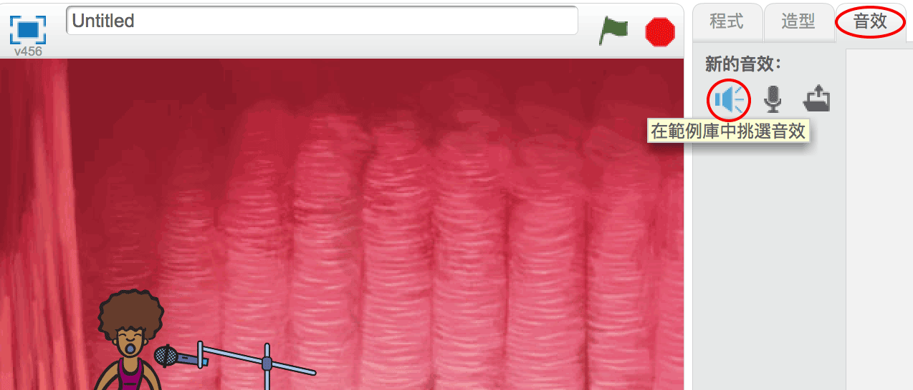

## 製作歌手

讓我們為你的樂隊添加一位歌手吧！

+ 在你的舞臺上增加另外兩個角色：歌手和麥克風。
    
    

+ 在你讓歌手唱歌之前，你需要給你的角色添加聲音。 確保您選擇了歌手，然後單擊聲音選項卡，然後單擊 **從範例庫中挑選音效**:
    
    

+ 如果您點擊左側的 **人聲** ，您將可以選擇合適的聲音添加到您的角色。
    
    

+ 現在聲音已添加，您可以將此代碼添加到歌手：
    
    ```blocks
        當角色被點擊
        播放音效 [singer1 v] 到底
    ```

+ 點擊你的歌手，看看會發生什麼。她唱歌嗎？