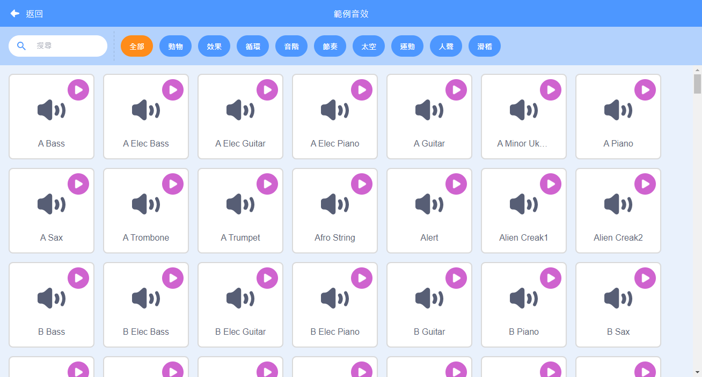
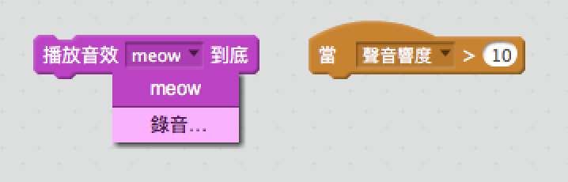

## 挑戰：改良你的樂隊

使用你在本專案學到的技能來創建自己的樂隊！你可以創造任何你想要的樂器 - 從範例庫看看有哪些跟樂器有關的角色和音效，從裡頭獲得靈感。



```blocks3
當角色被點擊
演奏樂器設為 (\(1\) 鋼琴 v)
演奏音階 (60) (0.25) 拍
```

你的樂器不一定要十分合理。例如，你可以让鬆餅製成鋼琴！


你可以用範例庫中現成的角色，也可以自己畫一個！


--- collapse ---
---
title: 為什麼角色在換造型時畫面有「跳」一下的感覺？
---
在創建自己的角色時，你可能會發現當你點擊角色，它在換造型時有「跳」一下，這是因為角色的兩個造型的中心位置不一樣。

這修正這個問題，請讓角色中每個造型的中心位置保持一致。

--- /collapse ---

如果你有麥克風，你可以錄下自己的聲音，甚至可以用攝像裝置來敲擊樂器！

