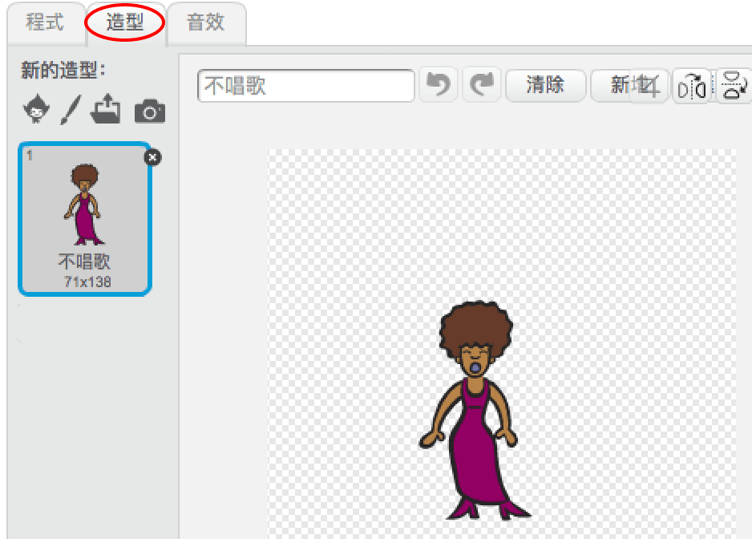
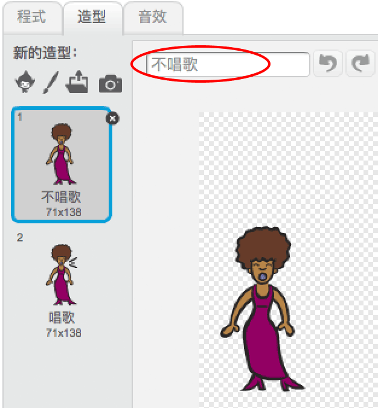
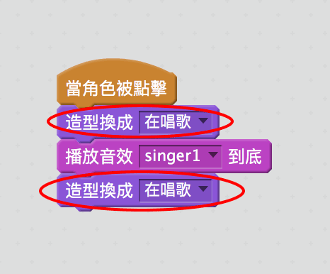

## 服裝

讓我們讓你的歌手看起來像她在唱歌！

+ 您還可以通過創建新服裝來更改您的歌手精靈在點擊時的外觀。點擊服裝標籤，你會看到歌手的形象。
    
    

+ 右鍵點擊服裝並點擊 **複製** 創建服裝的副本。
    
    

+ 點擊新的服裝（稱為'Singer2'），然後選擇線條工具並畫線，使其看起來像你的歌手正在發出聲音。
    
    

+ 目前服裝的名字並不是很有幫助。重命名這兩個服裝，通過在文本框中輸入每個服裝的新名稱，將它們稱為“不唱歌”和“唱歌”。
    
    

+ 現在你為歌手準備了兩套不同的服裝，你可以選擇顯示哪一件服裝！添加這兩個塊給你的歌手：
    
    
    
    用於更改服裝的代碼塊位於 `Looks`{：class =“blocklooks”}部分。

+ 點擊你的歌手。她看起來像她在唱歌嗎？